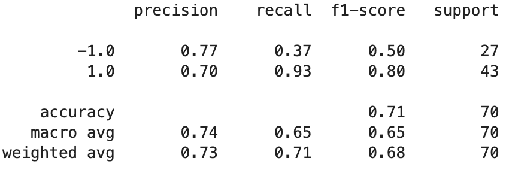
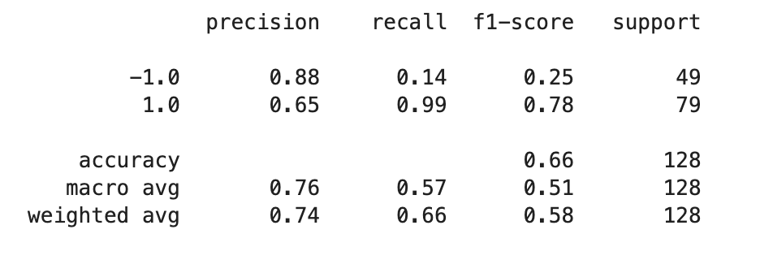
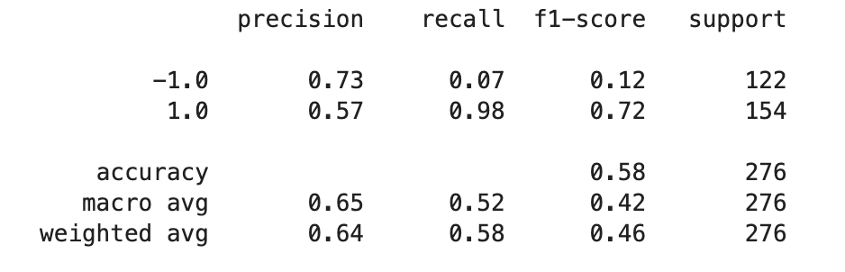

# algorithmic_trading_ML
Algorithmic trading bot with data to train a machine learning model to compare to base model 

## Technologies

This project leverages python 3.7 with the following packages:

* [numpy](https://pypi.org/project/numpy/) - For basic math usage.

* [pandas](https://github.com/pandas-dev/pandas) - For organizing data and creating DataFrames.

* [hvplot](https://pypi.org/project/hvplot/) - To gather historical and current market data. 

* [jupyterlab](https://jupyter.org/install.html) - To visualize the code in a modular format. 

* [mathplotlib](https://pypi.org/project/matplotlib/) - For visualizations in python. 

* [sklearn](https://pypi.org/project/scikit-learn/) - A Python module for machine learning built on top of SciPy. 

---

## Installation Guide

Before running the application first install the following.

```python
  pip install jupyterlab
  pip install pandas
  pip install numpy
  pip install hvplot
  pip install jupyterlab
  pip install matplotlib
  pip install scikit-learn
```

---

## Usage


To use the application simply clone the repository and open with JupyterLab. Proceed to run the modules and visualize the plotted data, and view the organized data. Change the window of the data calculated in the training section to note different recall and precision factors in the testing report.  

1 month of window size


3 months of window size


6 months of window size



---

## Contributors

Made by Owen Wardlaw : owardlaw@ucsd.edu.
---

## License

MIT
